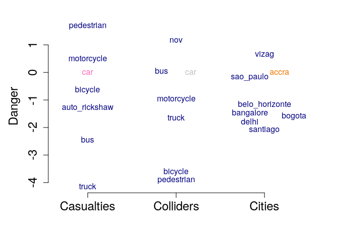

Injury imputation
================

Cities accra, sao\_paulo, delhi, bangalore, santiago, belo\_horizonte, bogota, vizag have who-hit-whom (WHW) matrices.

Cities buenos\_aires, mexico\_city don't.

Can we use the WHW matrices of the cities that have them and predict them for those that don't, using distances by mode for all cities?

The data are distances and fatal road-traffic collisions taken from <http://github.com/ithim/ithim-r>.

Basic regression
----------------

We start with cities with WHW matrices, and we keep only injuries that have distances for both parties involved in the crash.

We fit a model with three categorical covariates: the mode of the casualty, the mode of the colliding vehicle, and the city. We assume a Poisson distribution for the fatality counts and use the distances travelled and the years of data collection as the offset.

The figure shows how much each level of the three covariates is expected to contribute to risk:

The coloured levels in the middle are the reference values for each category. As we might expect: pedestrians are most at risk, and pose the least risk; trucks suffer the least risk. NOV, which stands for no other vehicle, seems to cause most fatalities - perhaps this represents missing information, rather than true collisions with no other vehicle.

------------------------------------------------------------------------

Evidence synthesis
------------------

To include the cities without matrices in the regression model, and to impute their matrices, we use the information we have: the number of fatalities per mode, each of which (in reality) is a sum over collider modes. This constitutes a separate arm of the inference, which again uses a Poisson distribution to describe the sums. The new cities' counts will drive the coefficients for the city intercepts; the regression coefficients for the collider modes from the old cities will drive the disaggregation of the sum into component collider parts; and all cities, new and old, will inform the coefficients for the casualty modes.

We see a similar pattern as before in terms of the modes (indeed the collider coefficients are (and should be) exactly the same). The two new cities share the middle of space of all the cities with Belo Horizonte, Bangalore and Bogota.

------------------------------------------------------------------------

Imputed matrices
----------------

From the output of the regression, we can estimate the expected fatalities for each combination of modes:

### Buenos Aires

|            |  car|  pedestrian|  motorcycle|  bus|  bicycle|
|------------|----:|-----------:|-----------:|----:|--------:|
| car        |   77|         334|         122|    5|       20|
| motorcycle |   37|         159|          58|    2|       10|
| bicycle    |    1|           5|           2|    0|        0|
| pedestrian |    1|           6|           2|    0|        0|
| bus        |   20|          88|          32|    1|        5|
| nov        |   27|         119|          43|    2|        7|

### Mexico City

|            |  car|  pedestrian|  motorcycle|  bus|  bicycle|
|------------|----:|-----------:|-----------:|----:|--------:|
| car        |  145|         250|         191|    8|       36|
| motorcycle |   57|          98|          75|    3|       14|
| bicycle    |    2|           4|           3|    0|        1|
| pedestrian |    1|           2|           1|    0|        0|
| bus        |   37|          64|          49|    2|        9|
| nov        |   31|          53|          41|    2|        8|

------------------------------------------------------------------------

### Who-hit-whom matrices

These can be compared to the raw matrices from the other cities:

accra

|             |  car|  pedestrian|  motorcycle|  bus|  bicycle|
|-------------|----:|-----------:|-----------:|----:|--------:|
| truck       |   72|         158|          58|   24|       27|
| unk         |    0|          69|           6|    0|        5|
| car         |   51|         642|          97|    6|       52|
| bus\_driver |   18|         150|          25|    6|        8|
| mini        |   13|         190|          47|    5|       24|
| motorcycle  |    7|          74|          10|    0|        5|
| bicycle     |    0|           4|           0|    1|        0|
| picku       |    3|          74|          11|    0|        3|
| ?           |    1|         108|           3|    0|        4|
| pedestrian  |    9|           0|          10|    0|        0|
| tract       |    4|          22|           5|    0|        0|
| other       |    3|           5|           0|    0|        1|

sao\_paulo

|                    |  pedestrian|  motorcycle|  bicycle|  car|  bus|
|--------------------|-----------:|-----------:|--------:|----:|----:|
| motorcycle         |         297|         482|       10|   16|    7|
| car                |         738|         536|       49|  227|    8|
| bus\_driver        |         368|         306|       48|   96|   19|
| pickup/light goods |          47|          48|        3|    7|    2|
| other              |           2|           3|        0|    0|    0|
| truck              |         151|         311|       21|   56|    2|
| listed\_na         |         283|           0|        0|    0|    0|
| bicycle            |           3|           1|       42|    0|    0|

delhi

|             |  pedestrian|  bicycle|  motorcycle|  auto\_rickshaw|  car|  bus|
|-------------|-----------:|--------:|-----------:|---------------:|----:|----:|
| motorcycle  |          82|        8|          25|               2|    2|    1|
| car         |         200|       35|         141|              13|   21|    2|
| bus         |          61|       15|          60|               3|    4|    2|
| unspecified |           1|        0|           1|               0|    1|    0|
| unknown     |         426|       30|         259|              10|   16|    0|
| truck       |          95|       25|         139|               8|   21|    1|

bangalore

|             |  pedestrian|  bicycle|  motorcycle|  auto\_rickshaw|  car|  bus|
|-------------|-----------:|--------:|-----------:|---------------:|----:|----:|
| motorcycle  |         119|        3|          43|               0|    3|    0|
| car         |          87|        7|          47|               4|    1|    0|
| bus         |          39|        1|          59|               3|    2|    8|
| unspecified |           7|        3|          10|               0|    0|    0|
| unknown     |          59|        3|           8|               0|    2|    0|
| truck       |          62|        4|         102|               8|    7|    4|
| pedestrian  |           0|        0|           3|               0|    0|    0|
| bicycle     |           0|        0|           1|               0|    0|    0|

santiago

|            |  bus|  car|  bicycle|  motorcycle|  pedestrian|
|------------|----:|----:|--------:|-----------:|-----------:|
| bus        |    1|   10|        8|           4|          36|
| car        |    1|   20|        9|          14|          50|
| truck      |    0|    6|        6|           8|          16|
| motorcycle |    0|    0|        0|           1|           3|
| pedestrian |    0|    1|        0|           0|           0|
| other      |    0|    0|        0|           0|           0|
| unknown    |    0|    0|        0|           1|           5|
| bicycle    |    0|    0|        0|           0|           0|

belo\_horizonte

|                               |  pedestrian|  bicycle|  motorcycle|  car|  bus|
|-------------------------------|-----------:|--------:|-----------:|----:|----:|
| bicycle                       |           2|        0|           0|    0|    0|
| motorcycle                    |          57|        2|           6|    1|    0|
| car                           |          67|        4|          42|   20|    1|
| bus                           |          55|        3|          41|   24|    1|
| railway.train.railway.vehicle |           5|        0|           0|    0|    0|
| non.motor.vehicle             |           0|        0|           1|    0|    0|
| pedestrian                    |           0|        0|           2|    0|    0|

bogota

|             |  pedestrian|  bicycle|  motorcycle|  car|  truck|  bus|
|-------------|-----------:|--------:|-----------:|----:|------:|----:|
| bicycle     |           2|        1|           2|    0|      0|    0|
| motorcycle  |          73|        2|          32|    0|      0|    0|
| car         |          96|       14|          42|   15|      0|    0|
| bus         |          55|       15|          29|    2|      0|    7|
| unspecified |           7|        0|           0|    0|      0|    0|
| truck       |          12|        5|          17|    1|      1|    0|
| pedestrian  |           0|        1|           3|    0|      0|    1|

vizag

|                   |  pedestrian|  bicycle|  motorcycle|  car|  bus|
|-------------------|-----------:|--------:|-----------:|----:|----:|
| motorcycle        |         187|       13|         151|    0|    0|
| car               |          98|       12|          56|   21|    0|
| bus               |          61|        9|          44|    0|   14|
| non.motor.vehicle |           1|        0|           0|    0|    0|
| unspecified       |          52|        4|          10|    0|    0|
| unknown           |           1|        4|           4|    0|    0|
| truck             |         120|       29|         157|   13|    1|

------------------------------------------------------------------------

Still to do:

Include interactions between covariates (particularly pedestrian-pedestrian collisions); include distributions to describe distances; ascribe noise differentially to modes;
